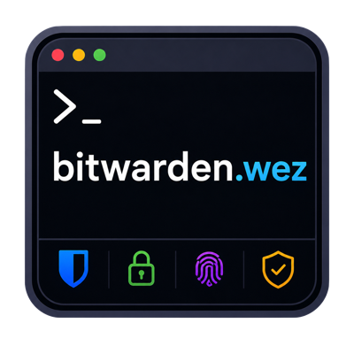
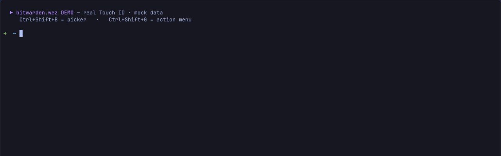
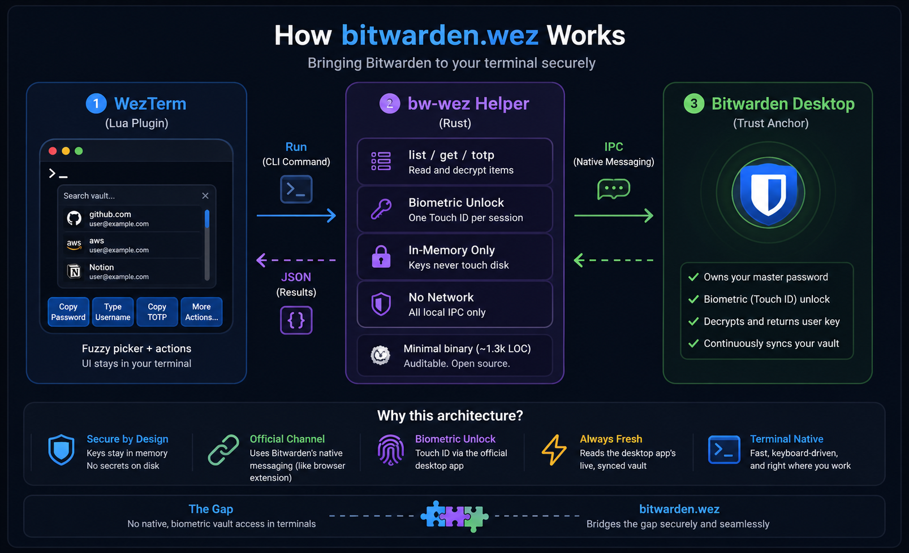

<div align="center">
  

  <h1>bitwarden.wez</h1>

  <p><strong>A Bitwarden vault picker for WezTerm.</strong><br/>
  Fuzzy-search your vault, unlock with Touch ID, and copy or type passwords, usernames, and TOTPs without the <code>bw</code> CLI.</p>

  <p>
    
  </p>

  <p>
    
    
    
    
    
    
    <a href="https://scorecard.dev/status/github.com/usrivastava92/bitwarden.wez"></a>
  </p>
</div>

---

## Overview

`bitwarden.wez` brings the Bitwarden browser-extension flow into WezTerm:

- **Fuzzy picker** over your whole vault from a keybind
- **Fast actions** for password, username, TOTP, URI, and notes
- **Biometric unlock** through the official Bitwarden desktop app
- **No `bw` CLI required** and no master password handling in the plugin
- **Always fresh** because it reads the desktop app's synced vault data
- **Clipboard auto-clear** with `type_password` when you want to avoid the clipboard entirely

> **Current status:** end-to-end working on **macOS** with Bitwarden Desktop + Touch ID, including personal and organization login items. Linux and Windows are planned next.

---

## What It Does

| Action | Result |
| --- | --- |
| Open picker | Search across login items in your vault |
| Press Enter | Run your configured default action |
| Copy password | Put the password on the clipboard, then auto-clear it |
| Type password | Send the password directly to the active pane |
| Copy username / TOTP / URI / notes | Pull the selected field on demand |
| Lock agent | Drop the in-memory key immediately |

Default workflow: **press keybind -> Touch ID -> pick item -> copy or type secret**.

---

## Installation

Add this to your `wezterm.lua`:

```lua
local wezterm = require 'wezterm'
local config = wezterm.config_builder()

local bw = wezterm.plugin.require 'https://github.com/usrivastava92/bitwarden.wez'

bw.apply_to_config(config)

return config
```

All options have sensible defaults. Override only what you need:

```lua
bw.apply_to_config(config, {
  default_action = 'type_password',
  clear_clipboard_seconds = 0,
})
```

### Updating

WezTerm caches plugins locally and does **not** auto-update them. After pulling changes, run this in the WezTerm debug overlay:

```lua
wezterm.plugin.update_all()
```

Then restart WezTerm or reload your config.

### Pinning a version

WezTerm's plugin loader takes **only the repository URL** — there is no `tag`,
`version`, or `branch` argument, and it always checks out the default branch
(`main`). So the plugin already tracks the latest `main`, and there is nothing to
set for "use latest".

If you want to freeze a specific release, pin it manually after the first load:
locate the clone with `wezterm.plugin.list()`, then in that directory check out
the tag —

```sh
git -C "<plugin_dir>" checkout v0.1.0
```

It stays on that tag until you switch back to `main` (note that
`wezterm.plugin.update_all()` pulls `main`, which un-pins it).

---

## Quick Start

### Real setup on macOS

1. Install the **Bitwarden desktop app**.
2. Sign in and enable these settings:
   - **Allow browser integration**
   - **Unlock with Touch ID**
3. Keep the desktop app running.
4. Reload WezTerm and press your `bitwarden.wez` keybind.

The helper binary is bundled in `bin/<target_triple>/`, so the plugin works without asking users to build or download anything separately.

### Try the UX without setup

Use the mock backend to test the picker with fake vault data:

```lua
local wezterm = require 'wezterm'
local config = wezterm.config_builder()

local bw = wezterm.plugin.require 'file:///path/to/bitwarden.wez'

bw.apply_to_config(config, {
  helper = '/path/to/bitwarden.wez/mock/bw-wez',
})
```

> The default keybinding is `Ctrl+Shift+B`.

### Build from source instead of using the bundled helper

```sh
cd helper
cargo build --release
```

```lua
bw.apply_to_config(config, {
  helper = '/abs/path/to/bitwarden.wez/helper/target/release/bw-wez',
})
```

---

## Configuration

```lua
bw.apply_to_config(config, {
  helper_args = {},

  default_action = 'copy_password', -- copy_password | type_password | copy_username | copy_totp | menu

  menu_key = 'g',
  menu_mods = 'CTRL|SHIFT',

  clear_clipboard_seconds = 20,
  fuzzy = true,
  notify = true,
})
```

### Common options

| Option | Default | Notes |
| --- | --- | --- |
| `helper` | bundled binary | Override with your own build or the mock backend |
| `helper_args` | `{}` | Extra args passed before the subcommand |
| `key`, `mods` | `b`, `CTRL|SHIFT` | Main picker keybind |
| `default_action` | `copy_password` | Also supports `type_password`, `copy_username`, `copy_totp`, `menu` |
| `menu_key`, `menu_mods` | optional | Separate action-menu binding |
| `clear_clipboard_seconds` | `20` | Set `0` to disable auto-clear |
| `fuzzy` | `true` | Fuzzy search in the picker |
| `notify` | `true` | Show result notifications |

### Custom keybinds

```lua
local bw = wezterm.plugin.require 'file:///path/to/bitwarden.wez'
bw.apply_to_config(config, { helper = 'bw-wez' })

table.insert(config.keys, {
  key = 'u',
  mods = 'CTRL|SHIFT',
  action = bw.picker(bw.opts, 'type_username'),
})
```

---

## Why You Can Trust This

This plugin touches passwords, so it has to earn trust rather than ask for it.
The goal is not "trust us blindly". The goal is to make the design easy to
inspect, easy to verify, and conservative about where secrets live.

### The short version

- **We never ask for, see, or store your master password**
- **Biometric unlock is delegated to the official Bitwarden desktop app**
- **We do not use the `bw` CLI** or ask you to export a long-lived session token
- **The vault key is held in RAM only**, `mlock`'d and wiped on lock, idle, or exit
- **The helper writes no secret to disk**, opens no network sockets, and has no telemetry
- **The plugin reads the same desktop app data you already trust Bitwarden with**

If you already use Bitwarden Desktop and its browser integration, this project is
intentionally built to sit on top of that trust boundary rather than invent a new one.

### What we optimized for

Security was the main design constraint from the start:

- Keep the trusted codepath small and readable
- Reuse Bitwarden's existing biometric and desktop-app bridge instead of reimplementing login flows
- Avoid persistent secrets, session files, environment tokens, and shell-based secret handling
- Keep all sensitive operations local to your machine
- Make the claims auditable from source and from simple terminal commands

### Where secrets live

| Secret | Where it lives | On disk? | Who holds it |
| --- | --- | --- | --- |
| Master password | Never entered into this tool | Never | You and Bitwarden's official apps |
| Biometric secret | macOS Keychain / Secure Enclave | Yes, managed by the OS | Bitwarden desktop app |
| Handshake transport key | Helper RAM for one connection | Never | Helper only |
| Vault user key | `bw-wez agent` RAM, `mlock`'d | Never | Agent only |
| Decrypted item | RAM, then clipboard or pane | Never by this tool | You |
| Encrypted vault data | Desktop app `data.json` | Yes | Bitwarden desktop app storage |

### What gets written to disk

Only a local Unix socket:

```text
~/Library/Caches/bw-wez/agent.sock
```

It is created with `0600` permissions. There is no on-disk session file, decrypted cache, or stored vault key.

### Why the desktop-app bridge matters

The unlock path is intentionally anchored to infrastructure you likely already use:

- The official **Bitwarden desktop app** owns the biometric-gated key
- The helper talks to Bitwarden's `desktop_proxy` over local IPC
- The desktop app performs the biometric unlock flow
- The helper then uses the returned user key in-memory to decrypt the desktop app's already-synced vault

That means this project is not trying to replace Bitwarden's authentication model.
It is integrating with the same desktop-side mechanisms that Bitwarden's browser
extension ecosystem already relies on.

### About prebuilt binaries

The plugin ships with bundled helper binaries so install is simple, but that does
not mean you have to accept opaque binaries on faith.

- Releases are built in **GitHub Actions**, not on a maintainer laptop
- Release artifacts are published with **SHA-256 checksums**
- The workflow is set up for **build provenance attestation**
- `Cargo.lock` is committed so builds are reproducible and-minded
- You can **build the helper yourself** and point the plugin at your own binary

If you prefer source-first trust, that path is fully supported.

### Read the code

The sensitive parts are intentionally easy to locate:

- `plugin/init.lua`: picker UI, keybinds, clipboard handling, notifications
- `helper/src/transport/`: socket (`SocketTransport`) and native-messaging (`NativeMessagingTransport`) transports
- `helper/src/protocol.rs`: handshake and biometric unlock request
- `helper/src/vault.rs`: reads and decrypts Bitwarden Desktop's encrypted `data.json`
- `helper/src/agent.rs`: in-memory key handling, `mlock`, idle lock, local socket

If something is unclear, that is a documentation problem we want to fix.

### What you are trusting

1. The official **Bitwarden desktop app**
2. This helper and plugin
3. **WezTerm** and your OS

### Limits

- A compromised machine can still scrape memory or clipboard contents while unlocked.
- Clipboard-based flows are less safe than `type_password` for very sensitive secrets.

### Questions, audits, and contributions

This is exactly the kind of project where hard questions are healthy.

- If you want a design decision explained, open an issue and ask directly
- If you want to verify a security claim, start from the files above and the commands below
- If you do not want to run the bundled helper, build your own and point `helper` at it
- If you spot something concerning, report it; security review and skeptical reading are welcome

We genuinely rather answer a hard question than have you trust us blindly.

---

## Verify The Claims

Run these on macOS if you want to inspect the security properties directly:

```sh
# Cache dir should contain only the local socket
ls -la ~/Library/Caches/bw-wez/

# No secrets in argv or environment
pgrep -fl 'bw-wez agent'
ps eww -p "$(pgrep -f 'bw-wez agent')"

# No network sockets
lsof -a -p "$(pgrep -f 'bw-wez agent')" -i -nP

# Inspect the desktop-app handshake
BW_WEZ_DEBUG=1 bw-wez unlock
```

---

<div align="center">
  
</div>

---

## Backend Contract

The plugin only depends on this CLI contract, so the mock and real helper are interchangeable:

| Command | Output |
| --- | --- |
| `bw-wez status` | `{"status":"unlocked"\|"locked"\|"no-desktop"\|"error","message"?}` |
| `bw-wez list` | JSON array of `{id,name,username,folder,uri}` |
| `bw-wez get <id> --field <password\|username\|totp\|uri\|notes>` | raw value on stdout |

Other commands: `bw-wez unlock`, `bw-wez lock`, and `bw-wez stop`.

---

## Roadmap

- [x] WezTerm picker with copy, type, TOTP, menu, and clipboard auto-clear
- [x] Mock backend for zero-setup UX testing
- [x] Native-messaging transport and desktop-app handshake
- [x] macOS biometric unlock and in-process vault decryption
- [x] Personal and organization login items
- [x] In-memory agent with idle lock and `0600` local socket
- [x] Bundled helper binaries in the repo
- [ ] Linux transport
- [ ] Windows transport
- [ ] Self-contained biometric provider without desktop-app dependency

---

## Contributing And Auditing

The codebase is intentionally small and easy to inspect.

- Start with `plugin/init.lua` for the WezTerm side
- Read `helper/src/agent.rs` and `helper/src/vault.rs` for secret handling
- Read `helper/src/transport/` and `helper/src/protocol.rs` for the desktop bridge
- Open an issue if you want to audit a specific claim or workflow

Security review, bug reports, and PRs are welcome.

---

## License

MIT
